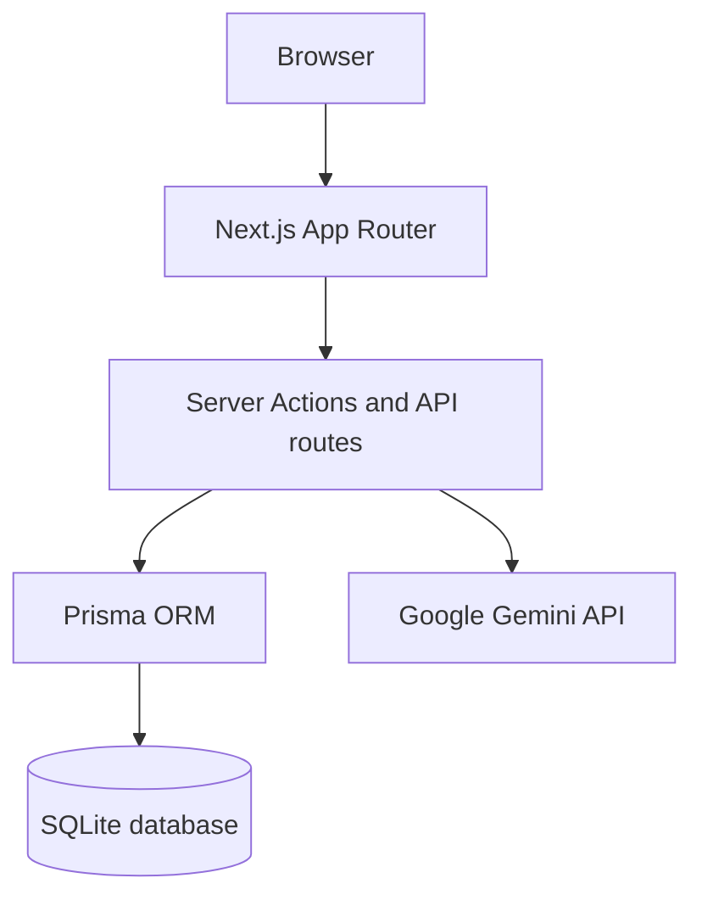
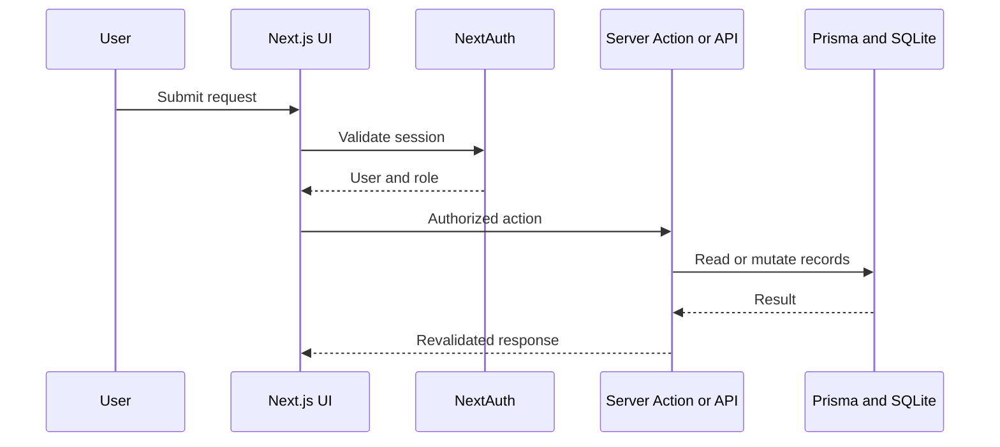
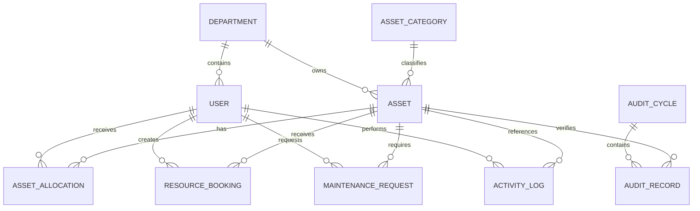

<div align="center">

# AssetHub

### AI-Powered Enterprise Asset & Resource Management Platform

AssetHub centralizes asset registration, department ownership, employee allocation, shared-resource booking, maintenance tracking, audits, activity history, operational reporting, and AI-assisted insights in one ERP-style web application.

[](https://nextjs.org/)
[](https://react.dev/)
[](https://www.typescriptlang.org/)
[](https://www.prisma.io/)
[](https://www.sqlite.org/)
[](https://ai.google.dev/)

[Repository](https://github.com/jananikuppan04-sys/AssetHub) · [Issues](https://github.com/jananikuppan04-sys/AssetHub/issues)

</div>

---

> **Project status:** Active development. Core authentication, organization setup, asset directory, database-backed dashboards, operational lists, audit logs, and the AI assistant are present. Several advanced workflows described in the product vision are still being completed. See [Implementation status](#implementation-status) for an honest module-by-module breakdown.

## Table of contents

- [Overview](#overview)
- [Problem statement](#problem-statement)
- [Solution](#solution)
- [Implementation status](#implementation-status)
- [Features](#features)
- [Roles](#roles)
- [Application routes](#application-routes)
- [System architecture](#system-architecture)
- [Data model](#data-model)
- [Technology stack](#technology-stack)
- [Project structure](#project-structure)
- [Getting started](#getting-started)
- [Environment variables](#environment-variables)
- [Demo account](#demo-account)
- [Development commands](#development-commands)
- [Security notes](#security-notes)
- [Known limitations](#known-limitations)
- [Roadmap](#roadmap)
- [Contributing](#contributing)
- [License](#license)

## Overview

AssetHub is an enterprise asset and shared-resource management system built for organizations that need real-time visibility into:

- What assets they own
- Where each asset is located
- Who currently holds an asset
- Which resources are available or booked
- Which assets require maintenance
- Which audit items are verified, damaged, or missing
- How assets are distributed across departments

The platform is suitable for offices, colleges, hospitals, factories, agencies, laboratories, and other organizations that manage physical assets or shared facilities.

AssetHub focuses on operational asset management. Purchasing, invoicing, payroll, and accounting are intentionally outside the current scope.

## Problem statement

Many organizations still track assets through spreadsheets, paper records, and disconnected communication. This creates avoidable problems:

- The same asset may be allocated more than once.
- Employees cannot easily identify the current asset holder.
- Shared rooms, vehicles, and equipment may receive overlapping bookings.
- Maintenance requests are difficult to prioritize and track.
- Overdue returns can remain unnoticed.
- Physical audits produce inconsistent or incomplete records.
- Managers lack reliable utilization and asset-health insights.
- Important administrative changes are not auditable.

## Solution

AssetHub provides a centralized ERP-style workspace with:

- Secure employee registration and authentication
- Admin-controlled role assignment
- Department hierarchy and employee directory
- Asset categories with maintenance and warranty metadata
- Unique asset tags and lifecycle states
- Allocation, booking, maintenance, and audit records
- Database-backed dashboard KPIs
- Activity logging for administrative and asset actions
- Rule-based asset health scoring
- Gemini-powered conversational assistance with a local fallback

## Implementation status

Legend:

- ✅ Implemented in the current repository
- 🟡 Partially implemented or requires hardening
- ⬜ Planned

| Module | Status | Current repository state |
| --- | :---: | --- |
| Login and session authentication | ✅ | Credentials authentication through NextAuth and bcrypt |
| Employee signup | ✅ | Signup always creates an `Employee` account |
| Forgot/reset password | 🟡 | Routes and reset-token fields exist; production email delivery still needs integration |
| Admin organization setup | ✅ | Departments, categories, employees, roles, status, statistics, and activity views |
| Department hierarchy | ✅ | Parent-child departments and Department Head assignment are modeled |
| Employee and department detail pages | ✅ | Detail views show linked members, assets, activity, and operational records |
| Asset registration and directory | ✅ | Database-backed create, list, filter action, and detail pages |
| Asset health score | ✅ | Explainable rule-based score using age, condition, repairs, and warranty |
| Dashboard KPIs | ✅ | Live counts from Prisma models |
| Dashboard charts | 🟡 | Chart library is installed; the distribution panel is currently a placeholder |
| Allocation records | 🟡 | Request action and list exist; approval, conflict prevention, transfer, and return flows need completion |
| Resource booking | 🟡 | Booking action and database-backed list exist; calendar and overlap validation need completion |
| Maintenance | 🟡 | Request action and database-backed list exist; approval and technician workflow need completion |
| Audit cycles | 🟡 | Audit data model and list exist; create, verify, discrepancy, and lock workflows need completion |
| Activity logs | ✅ | Database-backed organization and asset activity records are displayed |
| Reports | 🟡 | Report catalogue UI exists; CSV/PDF generation is not yet implemented |
| AssetHub AI assistant | ✅ | Gemini response path with database KPI context and a mock fallback |
| Natural-language record retrieval | 🟡 | Current AI context uses aggregate counts; record-level authorized retrieval is planned |
| Notifications and reminders | ⬜ | Not yet implemented |
| QR/barcode scanning | ⬜ | Fields exist in the asset model; generation and scanning are not yet implemented |
| Automated tests and CI | ⬜ | Test scripts and GitHub Actions are not yet present |
| Production database | ⬜ | Current repository uses SQLite for local development |

## Features

### Authentication

- Email and password login
- Password visibility control
- Inactive-account protection
- Employee signup with enforced `Employee` role
- Forgot-password and reset-password pages/API routes
- JWT-based NextAuth sessions
- Middleware-protected dashboard routes

### Organization setup

Admin-only organization management includes:

- Department creation and editing
- Department codes, descriptions, contact details, and locations
- Parent-child department hierarchy
- Department Head assignment
- Department activation and deactivation
- Asset-category creation and editing
- Category warranty and maintenance defaults
- Category metadata
- Employee directory and detail pages
- Department assignment
- Employee status management
- Role promotion
- Organization statistics and recent activity

### Asset directory

- Asset registration form
- Generated asset tag
- Category and department assignment
- Serial number and acquisition information
- Acquisition cost and warranty details
- Condition and lifecycle status
- Current location
- Bookable-resource flag
- Search/filter-ready server action
- Asset detail page
- Allocation, maintenance, and activity history
- Rule-based health score and predictive-risk category

### Operations

Database models and interfaces are present for:

- Asset allocations
- Shared-resource bookings
- Maintenance requests
- Technician assignment
- Audit cycles and audit records
- Activity logs

The [Roadmap](#roadmap) identifies the validation and approval rules still required before production use.

### Dashboard and reporting

Current dashboard KPIs include:

- Total assets
- Allocated assets
- Assets under maintenance
- Lost assets
- Active bookings
- Pending maintenance requests

The dashboard also provides recent activity and quick links to asset registration, booking, and maintenance.

The reports page currently lists:

- Asset Utilization
- Department Allocation
- Maintenance Trends
- Retirement Forecast
- Idle Assets
- Audit Discrepancies

### AssetHub AI assistant

AssetHub includes a conversational assistant powered by the Google GenAI SDK.

When `GEMINI_API_KEY` is configured, the assistant uses Gemini with current aggregate asset statistics. Without an API key, a development fallback returns clearly marked mock responses so the interface remains testable.

The current asset intelligence module also calculates:

- Asset health score from `0-100`
- Predictive maintenance risk: `Low`, `Medium`, or `High`

> The current health score is a transparent rules-based calculation, not a trained machine-learning model.

## Roles

The database supports four roles:

| Role | Intended responsibility |
| --- | --- |
| Admin | Organization setup, departments, categories, employees, roles, audits, and organization analytics |
| Asset Manager | Asset registration, allocation, transfers, returns, maintenance approvals, and reports |
| Department Head | Department assets, department approvals, and resource booking |
| Employee | Assigned assets, bookings, maintenance requests, transfer requests, and return requests |

Current authorization behavior:

- All dashboard routes require an authenticated session.
- Organization Setup is restricted to Admin through middleware and server-side session checks.
- Organization mutations independently verify the Admin role.
- Signup does not accept a privileged role from the client.
- Fine-grained role checks for every operational action are still being expanded.

## Application routes

### Public and authentication routes

| Route | Purpose |
| --- | --- |
| `/` | Redirects to the dashboard |
| `/login` | Credentials login |
| `/signup` | Employee registration |
| `/forgot-password` | Password-recovery request |
| `/reset-password` | Password reset |

### Protected dashboard routes

| Route | Purpose |
| --- | --- |
| `/dashboard` | KPI overview, recent activity, and quick actions |
| `/dashboard/organization` | Admin-only organization setup |
| `/dashboard/organization/departments/[id]` | Department profile |
| `/dashboard/organization/employees/[id]` | Employee profile |
| `/dashboard/assets` | Asset directory |
| `/dashboard/assets/new` | Asset registration |
| `/dashboard/assets/[id]` | Asset profile and history |
| `/dashboard/allocations` | Allocation records |
| `/dashboard/bookings` | Resource-booking records |
| `/dashboard/maintenance` | Maintenance records |
| `/dashboard/audits` | Audit cycles |
| `/dashboard/reports` | Report catalogue |
| `/dashboard/logs` | Activity logs |
| `/dashboard/assistant` | AssetHub AI assistant |

### API routes

| Route | Method | Purpose |
| --- | --- | --- |
| `/api/auth/[...nextauth]` | NextAuth | Authentication handler |
| `/api/auth/signup` | `POST` | Register an Employee account |
| `/api/auth/forgot-password` | `POST` | Create a reset request |
| `/api/auth/reset-password` | `POST` | Reset a password using a token |
| `/api/assistant` | `POST` | Generate an AssetHub AI response |

Most internal business mutations currently use Next.js Server Actions instead of public REST endpoints.

## System architecture



### Request flow



## Data model



Main Prisma models:

- `User`
- `Department`
- `AssetCategory`
- `Asset`
- `AssetAllocation`
- `ResourceBooking`
- `MaintenanceRequest`
- `AuditCycle`
- `AuditRecord`
- `ActivityLog`

## Technology stack

| Area | Technology |
| --- | --- |
| Full-stack framework | Next.js 16 App Router |
| UI | React 19, TypeScript 5 |
| Styling | Tailwind CSS 4 |
| Icons | Lucide React |
| Charts | Recharts |
| Authentication | NextAuth 4 Credentials Provider |
| Password hashing | bcrypt |
| ORM | Prisma 5 |
| Development database | SQLite |
| AI integration | Google GenAI SDK, Gemini 2.5 Flash |
| Notifications in UI | React Hot Toast |
| Date utilities | date-fns |
| Code quality | ESLint 9, Next.js Core Web Vitals rules |

## Project structure

```text
AssetHub/
├── prisma/
│   ├── schema.prisma          # Database schema
│   ├── seed.ts                # Development Admin seed
│   └── dev.db                 # Local SQLite database
├── public/                    # Static assets
├── src/
│   ├── app/
│   │   ├── actions/           # Server Actions for assets and operations
│   │   ├── api/               # Authentication and AI API routes
│   │   ├── dashboard/         # Protected ERP pages
│   │   ├── forgot-password/   # Password-recovery page
│   │   ├── login/             # Login page
│   │   ├── reset-password/    # Reset page
│   │   ├── signup/            # Employee registration page
│   │   ├── globals.css        # Global styles and design tokens
│   │   └── layout.tsx         # Root layout and providers
│   ├── components/
│   │   ├── assets/            # Asset health UI
│   │   ├── layout/            # Sidebar and top bar
│   │   ├── organization/      # Organization management components
│   │   └── ui/                # Shared UI components
│   ├── lib/
│   │   ├── ai.ts              # Health score and risk calculation
│   │   ├── auth.ts            # NextAuth configuration
│   │   └── prisma.ts          # Prisma client singleton
│   ├── middleware.ts          # Authentication and Admin route guard
│   └── types/                 # NextAuth type extensions
├── package.json
├── next.config.ts
├── tsconfig.json
└── README.md
```

## Getting started

### Prerequisites

- [Git](https://git-scm.com/)
- [Node.js](https://nodejs.org/) 20.9 or newer
- npm
- A Gemini API key only if real AI responses are required

SQLite is used locally, so a separate database server is not required.

### 1. Clone the repository

```bash
git clone https://github.com/jananikuppan04-sys/AssetHub.git
cd AssetHub
```

### 2. Install dependencies

```bash
npm install
```

### 3. Configure the environment

Create `.env.local` in the repository root:

```env
NEXTAUTH_URL=http://localhost:3000
NEXTAUTH_SECRET=replace_with_a_long_random_secret
GEMINI_API_KEY=
```

Generate a development secret if OpenSSL is available:

```bash
openssl rand -base64 32
```

The Gemini key is optional. Without it, the AI assistant uses a clearly labeled mock response.

### 4. Prepare the database

```bash
npx prisma generate
npx prisma db push
```

### 5. Seed the development Admin

```bash
npx --yes tsx prisma/seed.ts
```

### 6. Start the development server

```bash
npm run dev
```

Open [http://localhost:3000](http://localhost:3000).

## Environment variables

| Variable | Required | Description |
| --- | :---: | --- |
| `NEXTAUTH_URL` | ✅ | Local or deployed application URL |
| `NEXTAUTH_SECRET` | ✅ | Secret used to protect NextAuth tokens |
| `GEMINI_API_KEY` | Optional | Enables real Gemini responses in the AI assistant |

Environment files are ignored by Git. Never commit API keys or authentication secrets.

## Demo account

Use the following local development accounts:

```text
Primary Admin
Email: admin@assetsphere.com
Password: admin123
Role: Admin

Seeded AssetHub Admin
Email: admin@assethub.com
Password: admin123
Role: Admin
```

> These credentials are for local development and demonstration only. Change or remove all seeded passwords before any public deployment. The current `prisma/seed.ts` creates `admin@assethub.com`; add or update the seed record if `admin@assetsphere.com` is not already present in the local database.

New users can create accounts through `/signup`. Every signup is assigned the `Employee` role; an Admin must promote users from Organization Setup.

## Development commands

| Command | Purpose |
| --- | --- |
| `npm run dev` | Start the development server |
| `npm run build` | Create a production build |
| `npm run start` | Start the production server after building |
| `npm run lint` | Run ESLint |
| `npx prisma studio` | Inspect local database records visually |
| `npx prisma generate` | Generate the Prisma client |
| `npx prisma db push` | Synchronize the local schema |

Before opening a Pull Request, run:

```bash
npm run lint
npm run build
```

## Security notes

Current protections include:

- Password hashing with bcrypt
- JWT-based authenticated sessions
- Inactive-user login rejection
- Middleware protection for dashboard routes
- Admin-only Organization Setup
- Server-side Admin verification for organization mutations
- Employee-only public signup
- Environment-based secret management
- Activity logging for important administrative and asset actions

Required before production:

- Add strict input schemas with Zod or an equivalent validator.
- Add rate limiting to authentication and AI routes.
- Prevent account enumeration in signup and password recovery responses.
- Add fine-grained role checks to every operational Server Action.
- Enforce allocation and booking conflicts transactionally.
- Use a production database such as PostgreSQL.
- Remove committed development database files from source control.
- Add automated authorization and workflow tests.
- Restrict AI data retrieval according to the current user’s role and department.

## Known limitations

- The current database is SQLite and is intended for local development.
- Asset tags currently use the `AF-####` prefix in code; the intended AssetHub prefix is `AH-####`.
- Asset-tag generation needs a concurrency-safe implementation before production.
- An allocation request currently changes the asset status immediately instead of waiting for approval.
- Booking creation does not yet reject overlapping time ranges.
- Maintenance creation currently changes asset status before an approval workflow is completed.
- Transfer and return state machines are not yet implemented.
- Reports display export controls, but CSV/PDF generation is not connected.
- The dashboard chart panel is still a placeholder.
- AI answers currently receive aggregate counts rather than permission-filtered record retrieval.
- Notification delivery and reminders are not yet implemented.
- Automated tests and continuous integration are not yet configured.

## Roadmap

### Priority 0: demo stability

- [ ] Make `npm run lint` pass without warnings or errors
- [ ] Make `npm run build` pass consistently
- [ ] Add `.env.example`
- [ ] Remove tracked SQLite database files
- [ ] Rename generated asset tags from `AF-####` to `AH-####`
- [ ] Add realistic seed data for all four roles and operational modules

### Priority 1: business-rule correctness

- [ ] Prevent double allocation with a database transaction
- [ ] Add Department Head and Asset Manager transfer approvals
- [ ] Add return request and condition-verification workflow
- [ ] Reject overlapping resource bookings
- [ ] Change asset status only after maintenance approval
- [ ] Complete technician assignment, progress, and resolution
- [ ] Complete audit creation, verification, discrepancy, close, and lock

### Priority 2: product completeness

- [ ] Replace dashboard placeholder with Recharts visualizations
- [ ] Add notification center and scheduled reminders
- [ ] Add QR code and barcode generation/scanning
- [ ] Add photos and document uploads
- [ ] Implement CSV, PDF, and Excel exports
- [ ] Add advanced search, filters, pagination, and empty states
- [ ] Add dark mode and responsive mobile navigation

### Priority 3: production readiness

- [ ] Migrate from SQLite to PostgreSQL
- [ ] Add schema validation and structured errors
- [ ] Add unit, integration, and end-to-end tests
- [ ] Add GitHub Actions for lint, build, and test
- [ ] Add role- and department-aware AI retrieval
- [ ] Add monitoring, backups, secure deployment, and audit hardening

## Contributing

1. Update your local `main` branch.
2. Create a focused feature branch.
3. Implement and test one module or fix.
4. Run lint and the production build.
5. Push the branch and open a Pull Request.
6. Add screenshots and testing evidence to the PR.
7. Resolve review comments before merging.
8. Use **Squash and merge** to keep `main` history clean.

```bash
git checkout main
git pull origin main
git checkout -b feature/booking-conflict-validation

# Make and verify the change
npm run lint
npm run build

git add .
git commit -m "feat: prevent overlapping resource bookings"
git push -u origin feature/booking-conflict-validation
```

Recommended GitHub settings:

- Protect `main`.
- Require a Pull Request before merging.
- Require at least one approval.
- Require successful checks after CI is added.
- Allow squash merging.
- Keep auto-merge disabled until automated checks are reliable.

## License

No license file is currently included. Add a license before allowing external reuse or accepting public contributions.

---

<div align="center">

**AssetHub — know what you own, where it is, who holds it, and what it needs.**

Built as an enterprise asset-management project with Next.js, Prisma, and Gemini.

</div>
